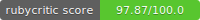
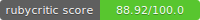

# Setup

`kata code score` 

`tests code score`


## Kata

Para ejecutar el kata se puede correr el script del archivo [`test.rb`](../app/test.rb) pasando le como argumentos los números para mostrar el mensaje secreto de la siguiente manera:

```bash
ruby test.rb 3 19
```

Todos los argumentos deben estar separados por un espacio y en caso de introducir un carácter que no sea un numero entero decimal, es omitido, el ejemplo anterior mostrara una salida en la terminal como la siguiente:

```bash
##############################
# The secrete handshake kata #
#                            #
##############################

secrete handshake for 3: 
["wink", "double wink"] 

secrete handshake for 19: 
["double wink", "wink"] 
```


## Pruebas

Para realizar las pruebas se utiliza Rspec y se evalúan los dos ejemplos que presenta la kata es decir los dos inputs de 3 y 9, estas pruebas se encuentran en el archivo [`handshake_spec.rb`](../spec/handshake_spec.rb)

Para ejecutar este script solo se debe correr el siguiente comando dentro de la carpeta [`spec`](../spec/):

```bash
rspec handshake_spec.rb
```

La salida esperada por consola debería ser: 

```bash
..

Finished in 0.00273 seconds (files took 0.08969 seconds to load)
2 examples, 0 failures
```
